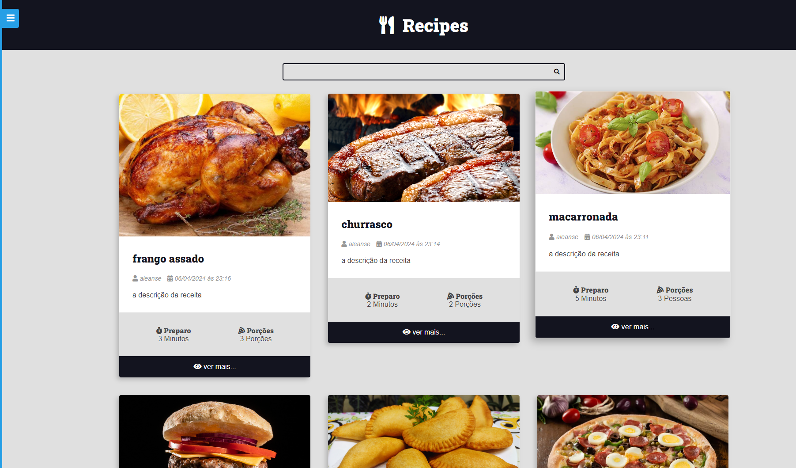
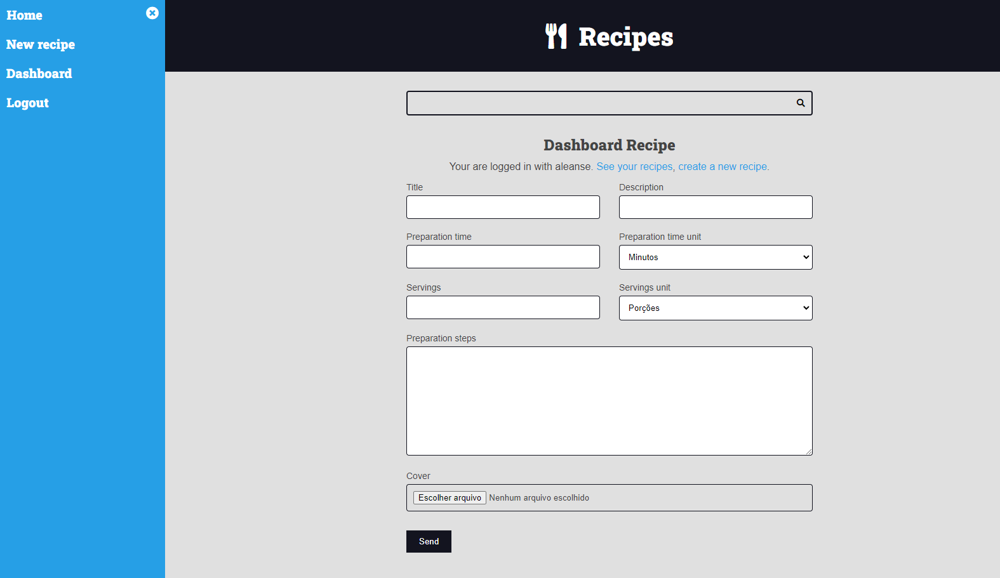

# Sobre o projeto
uma aplicação web onde os usuários podem criar uma conta, fazer login e compartilhar suas receitas favoritas. As receitas só aparecem no feed público após a aprovação do administrador do site. Os usuários podem editar e excluir suas receitas antes que elas sejam publicadas, mas uma vez no feed público, as receitas não podem ser editadas. Além disso, o site conta com um sistema de paginação e uma barra de pesquisa completamente funcional para facilitar a navegação e encontrar receitas específicas.
# Layout
## feed de receitas

## criar uma receita

## django admin

